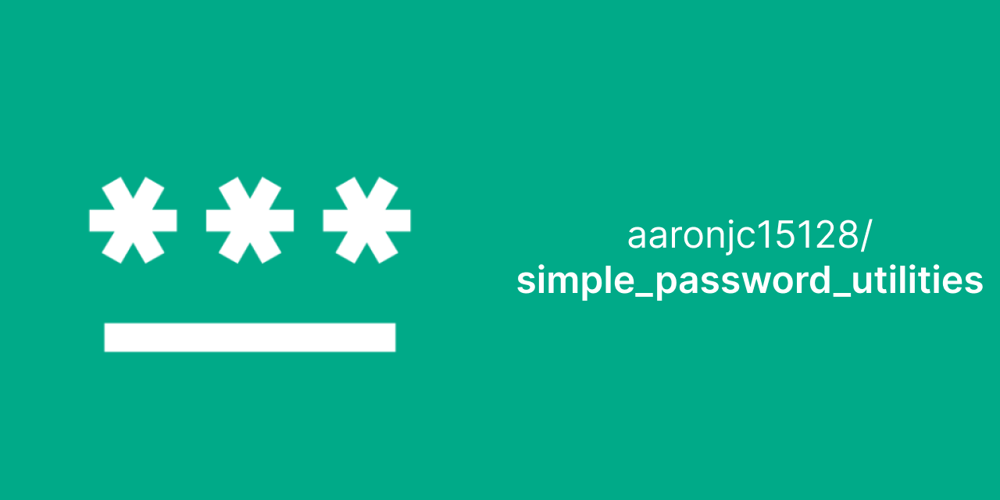

# Simple Password Utilities

Simple Password Utilities is a mobile app written in Dart with Flutter

## Features

* Simple Password Utilities offers a password generator with customizable parameters for length, capitals, numbers, and symbols
* It also includes a strength checker with a visual strength meter and a brute force time-to-crack calculator
* The app keeps a history of the last 10 generated passwords, displaying relevant parameters for each password
* It's a convenient tool for creating strong passwords, evaluating their strength, and managing your password history

## Installation

Install Simple Password Utilites from these places:
    

## Screenshots

## Authors

- [@aaronjc15128](https://www.github.com/aaronjc15128)

## Appendix

Any additional information goes here

